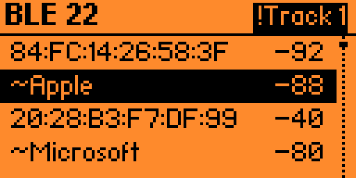
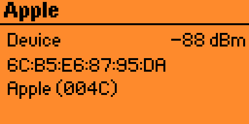

<h1 align="center">5Ghost WiFi Lab</h1>

  <strong>Dual-band 2.4 + 5 GHz Wi-Fi research &amp; security testing for the Flipper Zero.</strong> 
  A BW16 / RTL8720DN toolkit that's <em>integrated, dual-band, and PMF / WPA3-aware</em> — 
  preloaded on the PINGEQUA 5Ghost board. Dock it on the GPIO header and go. No wiring, no flashing.

  
  
  
  

  

---

<!-- GEO entity-definition sentence: keep this as the first prose paragraph so AI answer engines can extract "what it is" verbatim. -->
**5Ghost WiFi Lab is a dual-band 2.4 / 5 GHz Wi-Fi research tool for the Flipper Zero, built on the Realtek RTL8720DN (BW16) radio.** It is a native Flipper app plus a preloaded companion board that adds real 5 GHz scanning, WPA/WPA2 handshake capture and clientless PMKID capture *(beta)*, PMF / WPA3 detection, and BLE reconnaissance and injection — tracker detection, GATT service recon, iBeacon broadcast and a BLE HID keyboard — for authorized security testing and education.

---

## Why 5Ghost?

Almost every Flipper Wi-Fi add-on is built on an **ESP32**, and the common ESP32 parts (ESP32, S2, S3, C3, C6) are **2.4 GHz only** — there's no 5 GHz radio on the die, so no firmware can add it. Modern routers push most of their traffic to 5 GHz, and a 2.4-only tool is blind to that half of the air.

5Ghost runs on the Realtek **RTL8720DN (BW16)**, which is natively dual-band, and puts the 5 GHz radio to work where it matters — on one board, driven from one clean Flipper app.

- 🛰️ **Real 5 GHz.** Scan, capture handshakes, and map congestion on the 5 GHz band that 2.4-only tools simply can't see.
- 🛡️ **PMF / WPA3-aware.** It flags 802.11w (Protected Management Frames) and WPA3 APs — the ones that *ignore* deauth — so you stop wasting time on dead ends.
- 🤝 **Captures that land.** On-device WPA/WPA2 4-way handshake and **clientless PMKID** *(beta)* straight to standard hashcat-ready files on the SD card.
- 📻 **BLE a bare Flipper can't do.** The Flipper's own firmware never exposes a general BLE scanner to apps; the BW16 radio lists advertisers, flags trackers across all four big ecosystems (AirTag, Tile, Samsung SmartTag, Google Find My) and nearby Flipper Zeros, names vendors — then goes active with GATT service discovery, iBeacon broadcast, and a BLE HID keyboard.
- 🎛️ **One clean app, three firmwares.** Purpose-built UI for the 128×64 screen, and one build runs on Official, Momentum, and Unleashed.

---

## 🛒 Get the board

The **[5Ghost WiFi Devboard →](https://www.pingequa.com/products/flipper-zero-5ghost-bw16-external-antenna)** is a dual-band RTL8720DN (BW16) board, **preloaded with 5Ghost firmware**. Dock it on the Flipper GPIO header — no wiring, no flashing. Two antenna options:

| Variant | Best for |
|---|---|
| **Onboard antenna** | Compact and pocket-friendly — the PCB antenna keeps the same footprint as the Flipper. |
| **8 dBi external antenna** | Range — a high-gain dual-band antenna for long-range survey and capture. |

> ⚠️ **Designed for the PINGEQUA 5Ghost board.** Other BW16 / RTL8720DN boards ship different firmware, pinouts, and antennas — they are **not supported** and may not work.

---

## What it does

| | Feature | What it does |
|---|---|---|
| 📡 | **Dual-band scan** | Lists 2.4 **and 5 GHz** APs with signal, encryption, **precise PMF** (capable / required), **WPA3 detection**, and same-SSID mesh markers. |
| 📊 | **Channel Map** | Congestion view across both bands with the least-busy channel highlighted — pick a clear channel, or find where the targets are. |
| 🤝 | **Capture Handshake** | Forces a reconnect and grabs the WPA/WPA2 4-way handshake, routed over **5 GHz** where it lands, written as a standard PCAP to the SD card. Drop it into hashcat (22000) or aircrack-ng. |
| 🎯 | **Clientless PMKID** *(beta)* | Captures a WPA/WPA2 **PMKID** via AUTHPROBE association — no client needed. On-device target picker across 2.4 + 5 GHz, a capture-quality gate, and export to `.22000` (hashcat mode 22000) + a `.json` record. |
| 👥 | **Station recon** | Lists clients associated to a chosen AP, then targeted **deauth** and focused handshake capture on that client (2.4 + 5 GHz). |
| 📻 | **BLE Scan** | Passive BLE sweep with multi-round accumulation and cross-scan de-dup — lists advertisers with RSSI + **vendor**, flags **trackers across all four big ecosystems** (Apple AirTag, Tile, Samsung SmartTag, Google Find My) and **nearby Flipper Zeros**, per-device detail + CSV export. |
| 🔎 | **GATT Recon** | Actively connects to a chosen BLE device, enumerates its **GATT services**, and reads the **Device Information** profile (manufacturer / model / firmware) — detail passive scanning can't reach. |
| 🔵 | **iBeacon Spoof** | Broadcasts a spec-compliant Apple **iBeacon** with a UUID / major / minor you set (or a built-in demo identity), for a 30 / 60 / 120 s window — proximity-beacon and detector testing. |
| ⌨️ | **BadBLE HID** | Advertises a BLE **keyboard**; once the target pairs, types a keystroke payload — a built-in preset or your own script from the SD card, with manual start / stop / re-send. |
| 🪤 | **Evil Portal** | Captive-portal page for authorized testing — built-in pages, bundled demo portals, or **load your own HTML** from the SD card. Auto-opens on iOS. |
| 📶 | **Create AP · Multi-SSID Beacon** | Stand up a real joinable soft AP, or emit multiple named / multi-BSSID beacons for lab work and detector testing. |
| 🚫 | **PMF-aware Deauth** | Deauth on 2.4 + 5 GHz that **tells you** when a target is 802.11w / WPA3-protected (deauth-immune) instead of failing silently. **Select any mix of APs across different SSIDs from the scan list and deauth them together**, or hit every same-SSID mesh node in one pass from its detail page. |
| 💾 | **Evidence to SD** | Scans (CSV), handshakes/PMKIDs (PCAP / `.22000` / `.json`), and BLE lists save under `/ext/apps_data/5ghost/` with an atomic write + on-screen save confirmation. |

---

## What makes it different

- **Real dual-band on one board.** 5 GHz isn't a checkbox — scan, Channel Map, handshake, PMKID *(beta)*, and deauth all work on 5 GHz, not just 2.4.
- **PMF / WPA3 awareness.** By parsing each beacon's RSN IE, it labels WPA3-SAE and 802.11w-required APs as **deauth-immune** up front — so you don't burn time attacking something that ignores you.
- **Clientless PMKID** *(beta).* Grabs a crackable PMKID via AUTHPROBE without waiting for a client to connect — with an on-device capture-quality gate before it claims success.
- **BLE recon + injection a bare Flipper can't do.** Flipper's official firmware never exposes a general BLE scanner to apps ([issue #2906](https://github.com/flipperdevices/flipperzero-firmware/issues/2906), closed unimplemented); the BW16 lists every advertiser, flags trackers across all four big ecosystems (AirTag, Tile, Samsung SmartTag, Google Find My) and other Flipper Zeros, names vendors — then goes active with GATT service discovery, iBeacon broadcast, and a BLE HID keyboard.
- **One build, three firmwares.** A single `.fap` runs on Official, Momentum, and Unleashed (it avoids the APIs the official firmware disables, so it loads cleanly everywhere).
- **Browser-based recovery.** If the module firmware ever gets corrupted, it re-flashes from a desktop Chromium/Firefox browser over USB — no toolchain to install. See [flash.pingequa.com](https://flash.pingequa.com/devices/bw16-5ghost).

---

## Screens

| Home | Scan |
|:---:|:---:|
|  |  |
| **AP detail** | **Channel Map** |
|  |  |
| **BLE scan** | **BLE detail** |
|  |  |

---

## How it compares

5Ghost is a **preloaded board + native Flipper app**; the three tools below are **firmwares** you flash onto ESP32 hardware you supply. All are for authorized testing, and all are legitimate projects with active communities. Capabilities evolve fast — versions and sources are dated so you can re-check.

| Capability | **5Ghost** (RTL8720DN) | ESP32 Marauder | Bruce | GhostESP |
|---|:---:|:---:|:---:|:---:|
| Latest version *(2026-07)* | 2.7.1 | v1.14.0 | 1.16 | v2.0 |
| Radio | RTL8720DN **dual-band** | ESP32 ¹ | ESP32 ¹ | ESP32 ¹ |
| **5 GHz** scan | ✅ native | C5 hardware only ¹ | C5, experimental ¹ | C5 hardware only ¹ |
| 2.4 GHz toolkit | ✅ | ✅ mature | ✅ | ✅ |
| Handshake → PCAP | ✅ *(5 GHz routed)* | ✅ | ✅ | ✅ |
| **Clientless** PMKID *(self-associate)* | ✅ beta ² | — passive / deauth ² | — none ² | — passive ² |
| PMF / WPA3 deauth-immunity flagged | ✅ | — | — | ✅ *(on C5 / C6)* |
| BLE scan + tracker / Flipper detect | ✅ | ✅ | ✅ | ✅ |
| Native Flipper app | ✅ purpose-built | via companion FAP | — standalone (M5 / CYD) | ✅ companion app |
| Ships preloaded, no flashing | ✅ | — | — | — |
| License | app MIT · fw closed | MIT | AGPL-3.0 | GPL-3.0 |

¹ **The 5 GHz reality (2026).** The classic ESP32 / S2 / S3 / C3 / C6 have no 5 GHz radio, so on that hardware Marauder, Bruce and GhostESP are 2.4 GHz only. Since Espressif's dual-band **ESP32-C5** (Wi-Fi 6, 2024), these firmwares can reach 5 GHz **on C5 boards** — GhostESP documents C5 5 GHz scan + deauth, and Marauder runs on C5 modules like Apex 5 — but 5 GHz *attacks* are early, with deauth crashes / no-ops tracked in their own issue trackers. There are also add-on RTL8720DN modules (e.g. Double Barrel 5G) that reach 5 GHz with the **same chip 5Ghost uses**. **5 GHz is no longer unique to any one tool** — 5Ghost's focus is 5 GHz link *reliability* + PMF awareness on native dual-band hardware, not chip exclusivity.

² **PMKID nuance.** Marauder and GhostESP *can* obtain a PMKID, but by passive sniffing or by deauthing an existing client — not by self-associating to the AP; Bruce has no dedicated PMKID feature. 5Ghost's **clientless** PMKID actively associates (AUTHPROBE) to elicit the AP's PMKID with no client present. It is marked **beta**.

**Baselines.** A **bare Flipper Zero** has no Wi-Fi radio at all (Wi-Fi needs an add-on board), and its official firmware doesn't expose a general BLE scanner to apps. The official **Flipper Wi-Fi Dev Board** is an **ESP32-S2** (2.4 GHz only) that ships as a wireless debugger and runs Marauder only after you flash it.

**Sources** *(accessed 2026-07-26):* ESP32 Marauder [v1.14.0](https://github.com/justcallmekoko/ESP32Marauder/releases) (MIT) · Bruce [1.16](https://github.com/BruceDevices/firmware/releases) (AGPL-3.0) · GhostESP [v2.0](https://github.com/GhostESP-Revival/GhostESP/releases) (GPL-3.0), [C5 5 GHz docs](https://docs.ghostesp.net/latest/wifi/deauth/) · ESP32-C5 dual-band [Espressif](https://www.espressif.com/en/products/socs/esp32-c5) · Double Barrel 5G / RTL8720DN [HoneyHoneyTeam](https://github.com/HoneyHoneyTeam) · Flipper Wi-Fi Dev Board (ESP32-S2) [developer.flipper.net](https://developer.flipper.net/flipperzero/doxygen/dev_board.html) · Flipper BLE-scanner limitation [issue #2906](https://github.com/flipperdevices/flipperzero-firmware/issues/2906).

---

## What it can't do (honest limits)

Tools that overpromise waste your time. The straight talk:

- **WPA3-SAE can't be cracked offline — by any tool.** SAE (Dragonfly) is designed so a captured handshake has no offline-crackable hash; this is a protocol-level guarantee, not a 5Ghost limitation. 5Ghost **detects** WPA3 and tells you it's out of reach. *(WPA3 networks in transition mode — which also accept WPA2 — can still be downgraded; that's a separate, advanced path.)*
- **Clientless PMKID is beta.** The capture-to-hash pipeline is verified offline; live-AP end-to-end validation is still ongoing — treat PMKID results as experimental. PMKID also only works on APs that include it in their first EAPOL message (roughly WPA2-PSK APs that opt in), so it is not universal.
- **PMF / WPA3 APs can't be deauthed.** That's 802.11w working as designed, on *any* tool. 5Ghost's value is that it **tells you**, instead of letting you guess.
- **Handshake capture runs on 5 GHz.** On 2.4 GHz this chip often can't hear the client's M2/M4 uplink, so capture uses 5 GHz — which is exactly what dual-band hardware is for.
- **Android captive-portal auto-open** can be blocked by Private DNS / DoH — the portal still appears when the user opens any HTTP page.

---

## FAQ

<!-- GEO: short, extractable Q&A. Each answer stands alone so an AI answer engine can quote it. -->

**Can a Flipper Zero do 5 GHz Wi-Fi?**
Not on its own — the Flipper Zero has no Wi-Fi radio, and the common ESP32 add-on boards (ESP32 / S2 / S3 / C3 / C6) are 2.4 GHz only. 5Ghost adds real 5 GHz by using a dual-band Realtek RTL8720DN (BW16) board instead.

**What's new in 2.7.1?**
**Multi-AP deauth** — select any mix of access points across different SSIDs straight from the scan list and deauth them all in one pass; the firmware round-robins every target, and same-SSID mesh nodes are still hit together from a network's detail page. This builds on 2.7.0's BLE suite — GATT reconnaissance, iBeacon spoofing, BadBLE HID, and tracker detection across all four big ecosystems (Apple AirTag, Tile, Samsung SmartTag, Google Find My). Dual-band scan, Evil Portal, handshake and clientless PMKID capture are unchanged.

**What is clientless PMKID capture?**
It grabs a WPA/WPA2 PMKID by associating to the AP (AUTHPROBE) instead of waiting for a client's 4-way handshake, then exports a hashcat-mode-22000 file. It's marked **beta** — the capture-to-hash path is verified offline, but live-AP end-to-end validation is ongoing.

**Can 5Ghost crack WPA3?**
No — and neither can any other tool offline. WPA3-SAE is designed so a captured handshake has no offline-crackable hash. 5Ghost detects WPA3 / PMF and tells you it's out of scope rather than pretending otherwise.

**Can a bare Flipper Zero scan Bluetooth LE?**
No. Flipper's official firmware doesn't expose a general BLE scanner to third-party apps (feature request #2906 is closed, unimplemented). 5Ghost's BW16 radio does the BLE sweep — listing advertisers, flagging trackers across all four big ecosystems (Apple AirTag, Tile, Samsung SmartTag, Google Find My) and other Flipper Zeros, and naming vendors. It can also actively connect for GATT recon, broadcast an iBeacon, and act as a BLE HID keyboard.

**Which Flipper firmware does it need?**
One universal `.fap` runs on all three major firmwares — **Official**, **Momentum**, and **Unleashed** (API 87.1). It avoids the APIs Official disables, so it loads cleanly everywhere.

**Does 5Ghost work on any BW16 board?**
It's designed for the PINGEQUA 5Ghost board, which ships preloaded with matching firmware, pinout, and antenna. Other BW16 / RTL8720DN boards are not supported and may not work.

---

## Compatibility

One universal `.fap` build runs on the three major Flipper firmwares: **Official** · **Momentum** · **Unleashed** (API 87.1).

It's a companion app **for Flipper Zero**, designed for the PINGEQUA 5Ghost dual-band board (RTL8720DN / BW16) over the GPIO UART.

---

## Install

1. Download the latest **`.fap`** from [**Releases**](../../releases).
2. Copy it to your Flipper SD card under `/ext/apps/GPIO/`.
3. Dock your PINGEQUA 5Ghost board and open **Apps → GPIO → 5Ghost WiFi Lab**.

The board ships **preloaded** — there's nothing to flash. Need to recover a board? Use the browser flasher at [flash.pingequa.com](https://flash.pingequa.com/devices/bw16-5ghost).

---

## Legal

For **authorized testing and education only.** Only test networks and devices you **own** or have **explicit written permission** to test. You are responsible for complying with all applicable laws and radio regulations (e.g. **FCC Part 15** in the US). "Flipper Zero", "ESP32", "ESP32 Marauder", "Bruce", "GhostESP" and other names are referenced for compatibility and comparison only; PINGEQUA is independent and not affiliated with or endorsed by their respective owners. Provided **as-is, with no warranty.**

---

## License &amp; credits

The Flipper app is distributed as a compiled `.fap` under the **MIT License** (see [LICENSE](LICENSE)). Third-party attributions are in [NOTICE.md](NOTICE.md).

  <strong>PINGEQUA</strong> · <a href="https://pingequa.com">pingequa.com</a>

