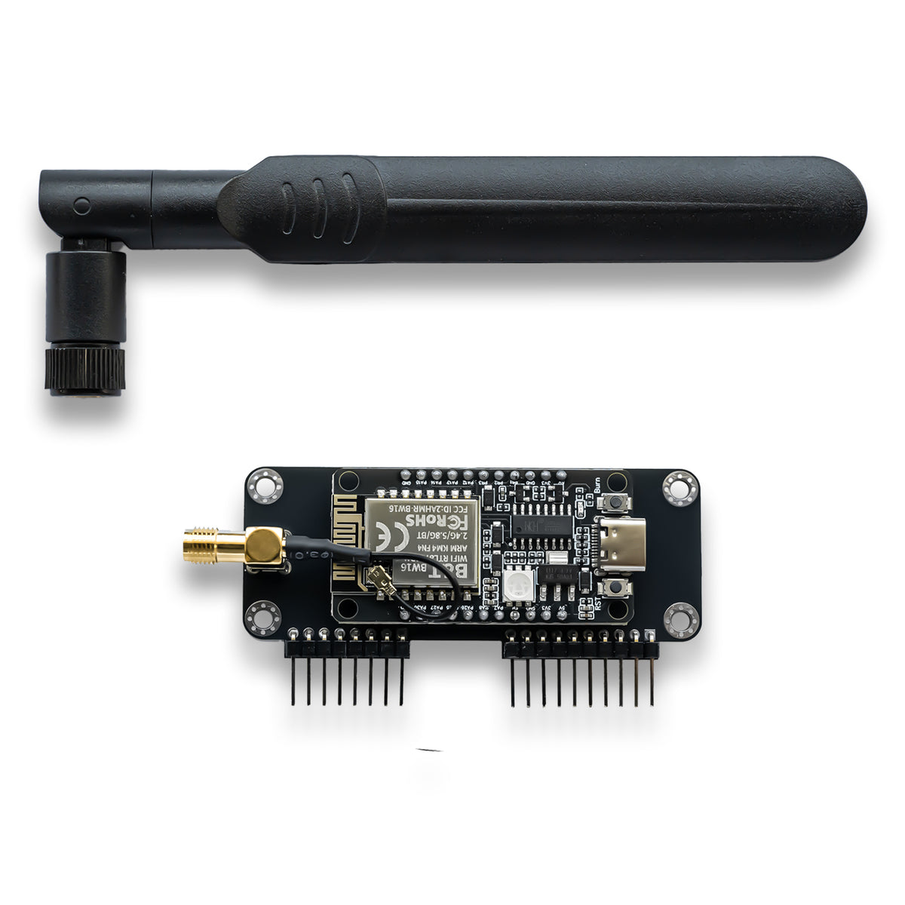
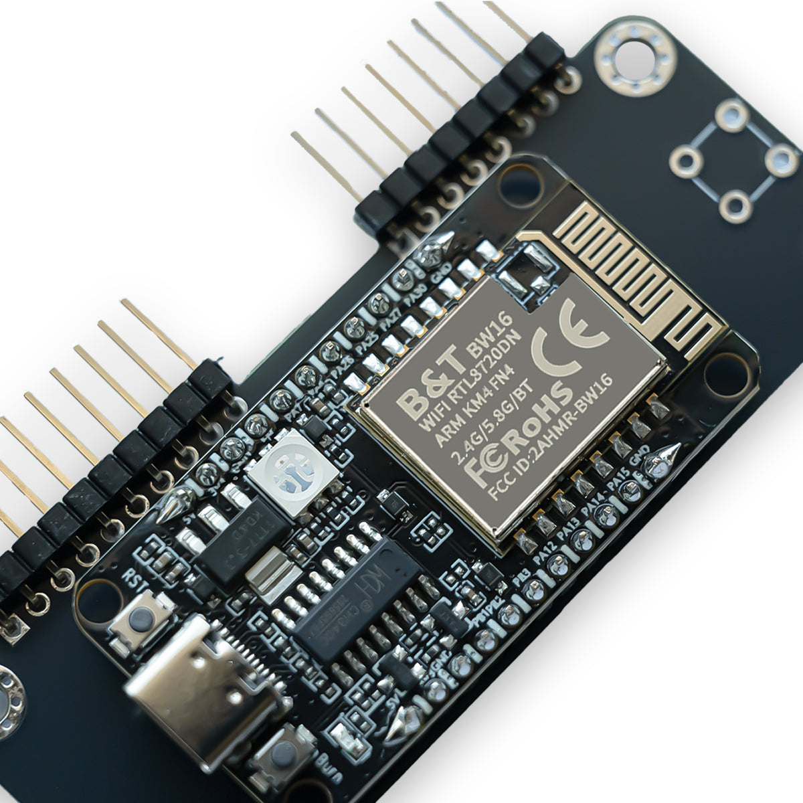

# 5Ghost WiFi Lab

**Dual-band 2.4 / 5 GHz Wi-Fi research on your Flipper Zero — powered by the PINGEQUA 5G WiFi dev board.**

  

The companion Flipper app for the **PINGEQUA Flipper Zero 5G WiFi board** (RTL8720DN / BW16). Native **5 GHz** *and* 2.4 GHz, **preloaded firmware** — plug it into the GPIO header and go. No wiring, no flashing.

## 🛒 Get the board

| | |
|---|---|
| **[Flipper Zero 5G WiFi Module →](https://www.pingequa.com/products/flipper-zero-5g-wifi-module)** | The dual-band RTL8720DN dev board, preloaded with 5Ghost firmware. |
| **[5G WiFi Board + 8dBi Antenna →](https://www.pingequa.com/products/flipper-zero-dual-band-5ghz-2-4ghz-wifi-devboard-preloaded-firmware-rtl8720dn-bw16-gpio-module-with-high-gain-8dbi-external-antenna-long-range-iot-network-analysis-packet-monitor-tool)** | Same board bundled with a long-range 8dBi external antenna. |

> ⚠️ **Designed for the PINGEQUA board only.** Other BW16 / RTL8720DN boards are **not supported** and may not work (different firmware, pinout, or antenna).

  

## What it does

- **Scan** 2.4 + **5 GHz** networks — SSID, signal, encryption, PMF, same-SSID mesh markers
- **Channel Map** — spot the least-congested channel across both bands
- **Capture Handshake** — WPA/WPA2 4-way handshake on 5 GHz → PCAP (crackable in hashcat / aircrack-ng)
- **Evil Portal** — captive-portal credential capture, with custom HTML from the SD card
- **Deauth · Create AP · Send Beacon**

…behind a clean, purpose-built UI, with PMF-aware targeting so you don't chase deauth-immune APs.

## Install the app

1. Download `ghost5_wifi_lab.fap` from [**Releases**](../../releases).
2. Copy it to your Flipper SD card under `/ext/apps/GPIO/`.
3. Plug in your PINGEQUA 5G board and open **Apps → GPIO → 5Ghost WiFi Lab**.

One universal build runs on **Official, Momentum, and Unleashed** firmware.

## Good to know

- **5 GHz does the heavy lifting** (handshakes, scanning) — the RTL8720DN hears what 2.4 GHz-only ESP32 tools can't.
- **Mesh & PMF aware** — flags 802.11w (deauth-immune) APs and same-SSID mesh nodes so you don't waste time on dead ends.

## Legal

For **authorized testing and education only**. Only test networks and devices you **own** or have **explicit permission** to test. You are responsible for complying with all applicable laws and radio regulations (e.g. **FCC Part 15** in the US). Provided **as-is, with no warranty**.

## License & credits

The Flipper app is distributed under the **MIT License** (see [LICENSE](LICENSE)) as a compiled `.fap`; third-party attributions are in [NOTICE.md](NOTICE.md).

— **PINGEQUA** · [pingequa.com](https://pingequa.com)
