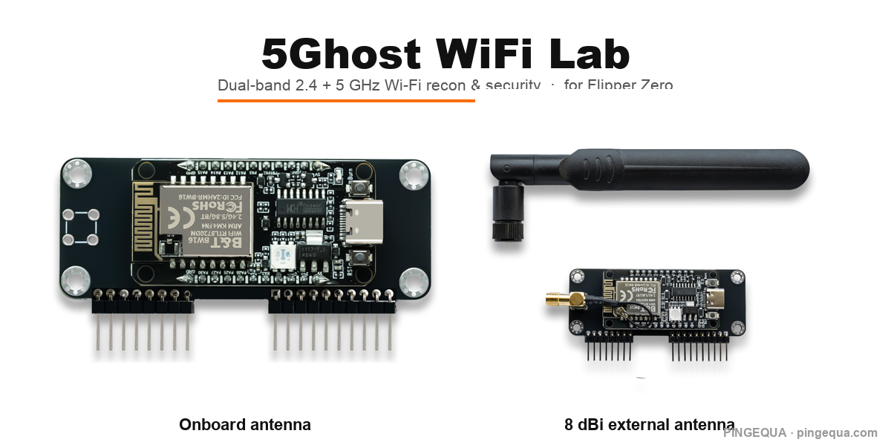
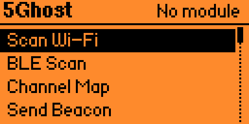
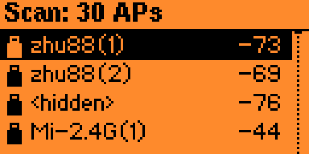
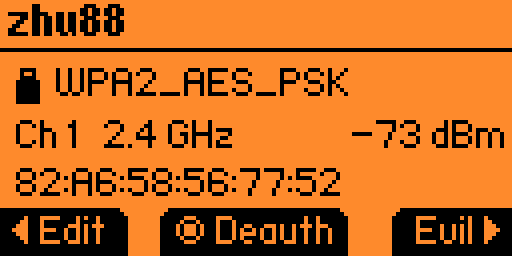
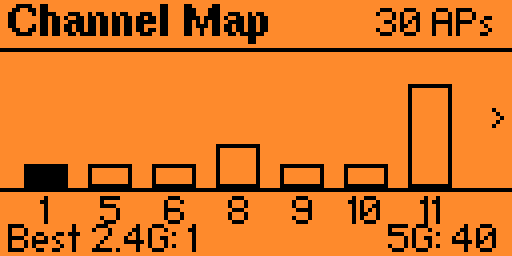

<h1 align="center">5Ghost WiFi Lab</h1>

  <strong>Dual-band 2.4 + 5 GHz Wi-Fi recon &amp; security testing for Flipper Zero.</strong> 
  The first BW16 / RTL8720DN toolkit that's <em>integrated, reliable, dual-band, and PMF / WPA3-aware</em> — 
  preloaded on the PINGEQUA 5G board. Plug into the GPIO header and go. No wiring, no flashing.

  
  
  
  

  

---

## Why 5Ghost?

Almost every Flipper Wi-Fi tool is **2.4 GHz only** — the popular ESP32-based ones *can't* do 5 GHz, because the chip has no 5 GHz radio. The few tools on **BW16 / RTL8720DN** hardware (which *does* have 5 GHz) are scattered: one does deauth, another does sniffing, most can't capture a handshake reliably, and **almost none tell you when an AP is immune to your attack.**

**5Ghost pulls it together on one board** — and puts the 5 GHz radio to work where it matters.

- 🛰️ **Real 5 GHz.** Scan, capture handshakes, and map congestion on the 5 GHz band that 2.4-only tools simply can't see.
- 🛡️ **PMF / WPA3-aware.** It flags 802.11w (Protected Management Frames) and WPA3 APs — the ones that *ignore* deauth — so you stop wasting time on dead ends. Almost no other tool surfaces this.
- 🤝 **Handshakes that land.** On-device WPA/WPA2 4-way handshake straight to a standard PCAP — verified on real hardware, crackable in hashcat / aircrack-ng.
- 🎛️ **One clean app.** Purpose-built UI for the 128×64 screen, not a wall of serial commands — and one build runs on all three major firmwares.

---

## 🛒 Get the board — two versions

Both are the same dual-band RTL8720DN board, **preloaded with 5Ghost firmware**. Dock it on the Flipper GPIO header — no wiring, no flashing.

| Version | Best for |
|---|---|
| **[Onboard antenna →](https://www.pingequa.com/products/flipper-zero-5g-wifi-module)** | Compact and pocket-friendly — the PCB antenna keeps the same footprint as the Flipper. |
| **[8 dBi external antenna →](https://www.pingequa.com/products/flipper-zero-dual-band-5ghz-2-4ghz-wifi-devboard-preloaded-firmware-rtl8720dn-bw16-gpio-module-with-high-gain-8dbi-external-antenna-long-range-iot-network-analysis-packet-monitor-tool)** | Range — a high-gain dual-band antenna for long-range survey and capture. |

> ⚠️ **Built for the PINGEQUA board.** Other BW16 / RTL8720DN boards ship different firmware, pinouts, and antennas — they are **not supported** and may not work.

---

## What it does

| | Feature | What it does |
|---|---|---|
| 📡 | **Dual-band scan** | Lists 2.4 **and 5 GHz** APs with signal, encryption, **precise PMF** (capable / required), **WPA3 detection**, and same-SSID mesh markers. |
| 📊 | **Channel Map** | Congestion view across both bands with the least-busy channel highlighted — pick a clear channel, or find where the targets are. |
| 🤝 | **Capture Handshake** | Forces a reconnect and grabs the WPA/WPA2 4-way handshake on **5 GHz**, written as a standard PCAP to the SD card. Drop it straight into hashcat (22000) or aircrack-ng. |
| 🪤 | **Evil Portal** | Captive-portal credential capture — built-in pages, **a few bundled demo portals**, or **load your own HTML** from the SD card. Auto-opens on iOS. |
| 🚫 | **PMF-aware Deauth** | Deauth on 2.4 + 5 GHz, and it tells you when a target is 802.11w / WPA3-protected (deauth-immune) instead of failing silently. Hits every same-SSID mesh node in one pass. |
| 📶 | **Create AP · Send Beacon** | Stand up a real joinable soft AP (with the captive portal), or flood custom / random / Rickroll beacons. |
| 💾 | **Everything to SD** | Scans (CSV), captured credentials, and handshakes (PCAP) all save to `/ext/apps_data/5ghost/`, with on-screen save confirmation. |

---

## What makes it different

The things 5Ghost does that most Flipper Wi-Fi tools don't:

- **Real dual-band on one board.** 5 GHz isn't a checkbox — scan, Channel Map, handshake capture, and deauth all work on 5 GHz, not just 2.4.
- **PMF / WPA3 awareness.** By parsing each beacon's RSN IE, it labels WPA3-SAE and 802.11w-required APs as **deauth-immune** up front — so you don't burn time attacking something that ignores you. Most tools just fail silently.
- **A 5 GHz handshake path that works.** On 2.4 GHz this chip often can't hear the client's uplink (M2/M4); 5Ghost routes handshake capture through 5 GHz where it reliably does — turning a flaky feature into one that lands.
- **One build, three firmwares.** A single `.fap` runs on Official, Momentum, and Unleashed (it avoids the APIs the official firmware disables, so it loads cleanly everywhere).
- **An Evil Portal that ships ready.** Custom HTML from the SD card, plus a few playful demo portals **bundled into the app** — they appear on the card automatically, nothing to copy.
- **Browser-based recovery.** If the module firmware ever gets corrupted, it can be re-flashed from the browser over USB — no toolchain to install. (See [pingequa.com](https://pingequa.com).)

---

## Screens

| Home | Scan |
|:---:|:---:|
|  |  |
| **AP detail** | **Channel Map** |
|  |  |

---

## How it compares

|  | **5Ghost WiFi Lab** | 2.4 GHz tools (ESP32 / Marauder-class) | Other BW16 firmware |
|---|:---:|:---:|:---:|
| **5 GHz** scan + attack | ✅ | ❌ *(no 5 GHz radio)* | partial |
| Handshake → **PCAP on device** | ✅ verified | varies | limited / standalone |
| **PMF / 802.11w + WPA3** awareness | ✅ | ❌ | ❌ |
| Evil Portal + **custom HTML** | ✅ | varies | rare |
| Native **Flipper app** UI | ✅ | ✅ | often serial / Web UI only |
| **One build** for 3 firmwares | ✅ | — | varies |

The 5 GHz radio + PMF/WPA3 awareness + a reliable on-device handshake path is the combination no single tool offered before. *(Capabilities of other projects vary by version — check their docs.)*

---

## What it can't do (honest limits)

Tools that overpromise waste your time. The straight talk:

- **WPA3-SAE can't be cracked offline — by any tool.** SAE (Dragonfly) is designed so a captured handshake has no offline-crackable hash; this is a protocol-level guarantee, not a 5Ghost limitation. No firmware or hardware breaks pure WPA3-SAE offline. 5Ghost **detects** WPA3 and tells you it's out of reach. *(WPA3 networks running in transition mode — which also accept WPA2 — can still be downgraded; that's a separate, advanced path.)*
- **PMF / WPA3 APs can't be deauthed.** That's 802.11w working as designed, on *any* tool. 5Ghost's value is that it **tells you**, instead of letting you guess.
- **Mesh roaming is hard.** Same-channel mesh nodes are hit in one pass; cross-channel 802.11r roaming is difficult to fully suppress on single-radio hardware. No tool truly solves this.
- **Handshake capture runs on 5 GHz.** On 2.4 GHz this chip often can't hear the client's M2/M4 uplink, so capture uses 5 GHz — which is exactly what dual-band hardware is for.
- **Android captive-portal auto-open** can be blocked by Private DNS / DoH — the portal still appears when the user opens any HTTP page.

---

## Compatibility

One universal `.fap` build runs on the three major Flipper firmwares: **Official** · **Momentum** · **Unleashed**.

It's a companion app **for Flipper Zero**, designed for the PINGEQUA 5G WiFi board (RTL8720DN / BW16) over the GPIO UART.

---

## Install

1. Download the latest **`.fap`** from [**Releases**](../../releases).
2. Copy it to your Flipper SD card under `/ext/apps/GPIO/`.
3. Plug in your PINGEQUA 5G board and open **Apps → GPIO → 5Ghost WiFi Lab**.

The board ships **preloaded** — there's nothing to flash.

---

## Legal

For **authorized testing and education only.** Only test networks and devices you **own** or have **explicit written permission** to test. You are responsible for complying with all applicable laws and radio regulations (e.g. **FCC Part 15** in the US). Provided **as-is, with no warranty.**

---

## License &amp; credits

The Flipper app is distributed as a compiled `.fap` under the **MIT License** (see [LICENSE](LICENSE)). Third-party attributions are in [NOTICE.md](NOTICE.md).

  <strong>PINGEQUA</strong> · <a href="https://pingequa.com">pingequa.com</a>

