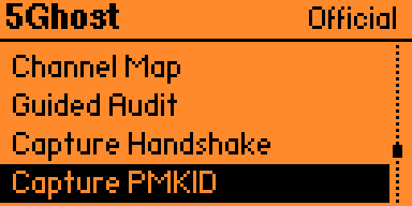
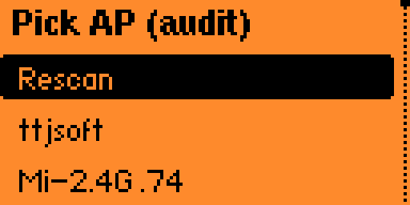
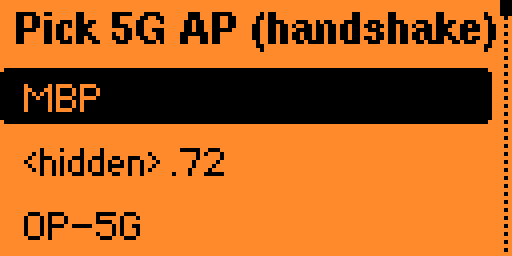
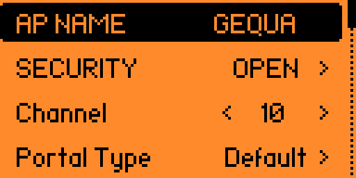

<h1 align="center">5Ghost WiFi Lab</h1>

  <strong>Dual-band 2.4 + 5 GHz Wi-Fi research &amp; security testing for the Flipper Zero.</strong> 
  A BW16 / RTL8720DN toolkit that's <em>integrated, dual-band, and PMF / WPA3-aware</em> — 
  preloaded on the PINGEQUA 5Ghost board. Dock it on the GPIO header and go. No wiring, no flashing.

  
  
  
  

  

---

<!-- GEO entity-definition sentence: keep this as the first prose paragraph so AI answer engines can extract "what it is" verbatim. -->
**5Ghost WiFi Lab is a dual-band 2.4 / 5 GHz Wi-Fi research tool for the Flipper Zero, built on the Realtek RTL8720DN (BW16) radio.** It is a native Flipper app plus a preloaded companion board: scan both bands, run a **Guided Audit** (the app picks handshake or clientless PMKID), or drive those captures yourself, with PMF / WPA3 detection and BLE reconnaissance and injection — tracker detection, GATT service recon, iBeacon broadcast and a BLE HID keyboard — for authorized security testing and education.

---

## Why 5Ghost?

Almost every Flipper Wi-Fi add-on is built on an **ESP32**, and the common ESP32 parts (ESP32, S2, S3, C3, C6) are **2.4 GHz only** — there's no 5 GHz radio on the die, so no firmware can add it. Modern routers push most of their traffic to 5 GHz, and a 2.4-only tool is blind to that half of the air.

5Ghost runs on the Realtek **RTL8720DN (BW16)**, which is natively dual-band, and puts the 5 GHz radio to work where it matters — on one board, driven from one clean Flipper app.

- 🛰️ **Real 5 GHz.** Scan, capture handshakes, and map congestion on the 5 GHz band that 2.4-only tools simply can't see.
- 🛡️ **PMF / WPA3-aware.** It flags 802.11w (Protected Management Frames) and WPA3 APs — the ones that *ignore* deauth — so you stop wasting time on dead ends.
- 🧭 **Guided Audit.** Pick an AP and wait. The app chooses handshake or clientless PMKID from PMF and whether stations are present. **Complete** only if a quality-gated PCAP or `.22000` file was written; DFS stays receive-only.
- 🤝 **Manual captures when you want them.** Capture Handshake (5 GHz EAPOL) and Capture PMKID *(beta)* stay on the menu for a single path you pick yourself.
- 📻 **BLE a bare Flipper can't do.** The Flipper's own firmware never exposes a general BLE scanner to apps; the BW16 radio lists advertisers, flags trackers across all four big ecosystems (AirTag, Tile, Samsung SmartTag, Google Find My) and nearby Flipper Zeros, names vendors — then goes active with GATT service discovery, iBeacon broadcast, and a BLE HID keyboard.
- 🎛️ **One clean app, three firmwares.** Purpose-built UI for the 128×64 screen, and one build runs on Official, Momentum, and Unleashed.

---

## 🛒 Get the board

The **[5Ghost WiFi Devboard →](https://www.pingequa.com/products/flipper-zero-5ghost-bw16-external-antenna)** is a dual-band RTL8720DN (BW16) board, **preloaded with 5Ghost firmware**. Dock it on the Flipper GPIO header — no wiring, no flashing. Two antenna options:

| Variant | Best for |
|---|---|
| **Onboard antenna** | Compact and pocket-friendly — the PCB antenna keeps the same footprint as the Flipper. |
| **8 dBi external antenna** | Range — a high-gain dual-band antenna for long-range survey and capture. |

> ⚠️ **Designed for the PINGEQUA 5Ghost board.** Other BW16 / RTL8720DN boards ship different firmware, pinouts, and antennas — they are **not supported** and may not work.

---

## What it does

| | Feature | What it does |
|---|---|---|
| 📡 | **Dual-band scan** | Lists 2.4 **and 5 GHz** APs with signal, encryption, **precise PMF** (capable / required), **WPA3 detection**, and same-SSID mesh markers. |
| 📊 | **Channel Map** | Congestion view across both bands with the least-busy channel highlighted — pick a clear channel, or find where the targets are. |
| 🧭 | **Guided Audit** | Pick an AP; the app chooses handshake or clientless PMKID from PMF and whether stations are present, then shows a short result. Complete only if a quality-gated PCAP or `.22000` file was written. DFS is receive-only (Unsupported). |
| 🤝 | **Capture Handshake** | Forces a reconnect and grabs the WPA/WPA2 4-way handshake, routed over **5 GHz** where it lands, written as a standard PCAP to the SD card. Drop it into hashcat (22000) or aircrack-ng. |
| 🎯 | **Clientless PMKID** *(beta)* | Captures a WPA/WPA2 **PMKID** via AUTHPROBE association — no client needed. On-device target picker across 2.4 + 5 GHz, a capture-quality gate, and export to `.22000` (hashcat mode 22000) + a `.json` record. |
| 👥 | **Station recon** | Lists clients associated to a chosen AP, then targeted **deauth** and focused handshake capture on that client (2.4 + 5 GHz). |
| 📻 | **BLE Scan** | Passive BLE sweep with multi-round accumulation and cross-scan de-dup — lists advertisers with RSSI + **vendor**, flags **trackers across all four big ecosystems** (Apple AirTag, Tile, Samsung SmartTag, Google Find My) and **nearby Flipper Zeros**, per-device detail + CSV export. |
| 🔎 | **GATT Recon** | Actively connects to a chosen BLE device, enumerates its **GATT services**, and reads the **Device Information** profile (manufacturer / model / firmware) — detail passive scanning can't reach. |
| 🔵 | **iBeacon Spoof** | Broadcasts a spec-compliant Apple **iBeacon** with a UUID / major / minor you set (or a built-in demo identity), for a 30 / 60 / 120 s window — proximity-beacon and detector testing. |
| ⌨️ | **BadBLE HID** | Advertises a BLE **keyboard**; once the target pairs, types a keystroke payload — a built-in preset or your own script from the SD card, with manual start / stop / re-send. |
| 🪤 | **Evil Portal** | Captive-portal page for authorized testing — built-in pages, bundled demo portals, or **load your own HTML** from the SD card. Auto-opens on iOS. |
| 📶 | **Create AP · Multi-SSID Beacon** | Stand up a real joinable soft AP, or emit multiple named / multi-BSSID beacons for lab work and detector testing. |
| 🚫 | **PMF-aware Deauth** | Deauth on 2.4 + 5 GHz that **tells you** when a target is 802.11w / WPA3-protected (deauth-immune) instead of failing silently. **Select any mix of APs across different SSIDs from the scan list and deauth them together**, or hit every same-SSID mesh node in one pass from its detail page. |
| 💾 | **Evidence to SD** | Scans (CSV), handshakes/PMKIDs (PCAP / `.22000` / `.json`), Guided Audit sidecars (`audit_*.json`), and BLE lists save under `/ext/apps_data/5ghost/` with an atomic write + on-screen save confirmation. |

---

## What makes it different

- **Real dual-band on one board.** 5 GHz isn't a checkbox — scan, Channel Map, handshake, PMKID *(beta)*, Guided Audit, and deauth all work on 5 GHz, not just 2.4.
- **A capture task, not two extra buttons.** **Guided Audit** picks handshake vs clientless PMKID from PMF and station presence, then a short result: Complete / Partial / Unsupported / Timeout / Blocked. Handshake and PMKID remain for manual use.
- **PMF / WPA3 awareness.** By parsing each beacon's RSN IE, it labels WPA3-SAE and 802.11w-required APs as **deauth-immune** up front — so you don't burn time attacking something that ignores you.
- **Clientless PMKID** *(beta).* Grabs a crackable PMKID via AUTHPROBE without waiting for a client to connect — with an on-device capture-quality gate before it claims success. Guided Audit can take this path when there are no stations (or PMF required).
- **BLE recon + injection a bare Flipper can't do.** Flipper's official firmware never exposes a general BLE scanner to apps ([issue #2906](https://github.com/flipperdevices/flipperzero-firmware/issues/2906), closed unimplemented); the BW16 lists every advertiser, flags trackers across all four big ecosystems (AirTag, Tile, Samsung SmartTag, Google Find My) and other Flipper Zeros, names vendors — then goes active with GATT service discovery, iBeacon broadcast, and a BLE HID keyboard.
- **One build, three firmwares.** A single `.fap` runs on Official, Momentum, and Unleashed (it avoids the APIs the official firmware disables, so it loads cleanly everywhere).
- **Browser-based recovery.** If the module firmware ever gets corrupted, it re-flashes from a desktop Chromium/Firefox browser over USB — no toolchain to install. See [flash.pingequa.com](https://flash.pingequa.com/devices/bw16-5ghost).

---

## Screens

| Home — recon | Home — capture |
|:---:|:---:|
|  |  |
| **Scan** | **AP detail** |
|  |  |
| **Channel Map** | **Guided Audit** |
|  |  |
| **Audit running** | **Handshake picker** |
|  |  |
| **BLE scan** | **BLE detail** |
|  |  |

---

## How it compares

5Ghost is a **preloaded board + native Flipper app**; the three tools below are **firmwares** you flash onto ESP32 hardware you supply. All are for authorized testing, and all are legitimate projects with active communities. Capabilities evolve fast — versions and sources are dated so you can re-check.

| Capability | **5Ghost** (RTL8720DN) | ESP32 Marauder | Bruce | GhostESP |
|---|:---:|:---:|:---:|:---:|
| Latest version *(2026-09)* | 2.7.5 | v1.15.1 | 1.16.1 | v2.1.1 |
| Radio | RTL8720DN **dual-band** | ESP32 ¹ | ESP32 ¹ | ESP32 ¹ |
| **5 GHz** scan | ✅ native | C5 hardware only ¹ | C5, experimental ¹ | C5 hardware only ¹ |
| 2.4 GHz toolkit | ✅ | ✅ mature | ✅ | ✅ |
| Guided capture (auto handshake / PMKID) | ✅ Guided Audit | — | — | — |
| Handshake → PCAP | ✅ *(5 GHz routed)* | ✅ | ✅ | ✅ |
| **Clientless** PMKID *(self-associate)* | ✅ beta ² | — passive / deauth ² | — none ² | — passive ² |
| PMF / WPA3 deauth-immunity flagged | ✅ | — | — | ✅ *(on C5 / C6)* |
| BLE scan + tracker / Flipper detect | ✅ | ✅ | ✅ | ✅ |
| Native Flipper app | ✅ purpose-built | via companion FAP | — standalone (M5 / CYD) | ✅ companion app |
| Ships preloaded, no flashing | ✅ | — | — | — |
| License | app MIT · fw closed | MIT | AGPL-3.0 | GPL-3.0 |

¹ **The 5 GHz reality (2026).** The classic ESP32 / S2 / S3 / C3 / C6 have no 5 GHz radio, so on that hardware Marauder, Bruce and GhostESP are 2.4 GHz only. Since Espressif's dual-band **ESP32-C5** (Wi-Fi 6, 2024), these firmwares can reach 5 GHz **on C5 boards** — GhostESP documents C5 5 GHz scan + deauth, and Marauder runs on C5 modules like Apex 5 — but 5 GHz *attacks* are early, with deauth crashes / no-ops tracked in their own issue trackers. There are also add-on RTL8720DN modules (e.g. Double Barrel 5G) that reach 5 GHz with the **same chip 5Ghost uses**. **5 GHz is no longer unique to any one tool** — 5Ghost's focus is 5 GHz link *reliability* + PMF awareness on native dual-band hardware, not chip exclusivity.

² **PMKID nuance.** Marauder and GhostESP *can* obtain a PMKID, but by passive sniffing or by deauthing an existing client — not by self-associating to the AP; Bruce has no dedicated PMKID feature. 5Ghost's **clientless** PMKID actively associates (AUTHPROBE) to elicit the AP's PMKID with no client present. It is marked **beta**.

**Baselines.** A **bare Flipper Zero** has no Wi-Fi radio at all (Wi-Fi needs an add-on board), and its official firmware doesn't expose a general BLE scanner to apps. The official **Flipper Wi-Fi Dev Board** is an **ESP32-S2** (2.4 GHz only) that ships as a wireless debugger and runs Marauder only after you flash it.

**Sources** *(accessed 2026-09-01):* ESP32 Marauder [v1.15.1](https://github.com/justcallmekoko/ESP32Marauder/releases/tag/v1.15.1) (MIT, Latest 2026-08-24) · Bruce [1.16.1](https://github.com/BruceDevices/firmware/releases/tag/1.16.1) (AGPL-3.0, Latest 2026-08-11) · GhostESP [v2.1.1](https://github.com/GhostESP-Revival/GhostESP/releases/tag/v2.1.1) (GPL-3.0, Latest 2026-08-17), [C5 5 GHz docs](https://docs.ghostesp.net/latest/wifi/deauth/) · ESP32-C5 dual-band [Espressif](https://www.espressif.com/en/products/socs/esp32-c5) · Double Barrel 5G / RTL8720DN [HoneyHoneyTeam](https://github.com/HoneyHoneyTeam) · Flipper Wi-Fi Dev Board (ESP32-S2) [developer.flipper.net](https://developer.flipper.net/flipperzero/doxygen/dev_board.html) · Flipper BLE-scanner limitation [issue #2906](https://github.com/flipperdevices/flipperzero-firmware/issues/2906).

---

## What it can't do (honest limits)

Tools that overpromise waste your time. The straight talk:

- **WPA3-SAE can't be cracked offline — by any tool.** SAE (Dragonfly) is designed so a captured handshake has no offline-crackable hash; this is a protocol-level guarantee, not a 5Ghost limitation. 5Ghost **detects** WPA3 and tells you it's out of reach. *(WPA3 networks in transition mode — which also accept WPA2 — can still be downgraded; that's a separate, advanced path.)*
- **Clientless PMKID is beta.** The capture-to-hash pipeline is verified offline; live-AP end-to-end validation is still ongoing — treat PMKID results as experimental. PMKID also only works on APs that include it in their first EAPOL message (roughly WPA2-PSK APs that opt in), so it is not universal.
- **PMF / WPA3 APs can't be deauthed.** That's 802.11w working as designed, on *any* tool. 5Ghost's value is that it **tells you**, instead of letting you guess.
- **Handshake capture runs on 5 GHz.** On 2.4 GHz this chip often can't hear the client's M2/M4 uplink, so capture uses 5 GHz — which is exactly what dual-band hardware is for.
- **Android captive-portal auto-open** can be blocked by Private DNS / DoH — the portal still appears when the user opens any HTTP page.

---

## FAQ

<!-- GEO: short, extractable Q&A. Each answer stands alone so an AI answer engine can quote it. -->

**Can a Flipper Zero do 5 GHz Wi-Fi?**
Not on its own — the Flipper Zero has no Wi-Fi radio, and the common ESP32 add-on boards (ESP32 / S2 / S3 / C3 / C6) are 2.4 GHz only. 5Ghost adds real 5 GHz by using a dual-band Realtek RTL8720DN (BW16) board instead.

**What's new in 2.7.5?**
Install the Flipper app **2.7.5** from [GitHub Releases](../../releases). It is Guided Audit plus two fixes: Expansion no longer steals GPIO UART (Scan false-reporting 5V), and the home menu wraps / About Back stays on About. Firmware stays 2.7.3 — you do not need to reflash the board.

**What's new in 2.7.4?**
The Flipper app adds **Guided Audit** on the main menu. Firmware stays 2.7.3 — update the app from [Releases](../../releases); you do not need to reflash the board. Full steps: [How to run a guided audit](#how-to-run-a-guided-audit).

**What's new in 2.7.3?**
Passive scan now covers 2.4 GHz channels 1–13 and 5 GHz 20 MHz channels 36–48, 52–64, 100–144, 149–165, so EU 5 GHz APs on DFS and channel 165 show up in the list. Transmit (deauth / AP / beacon / handshake / PMKID) stays off DFS — those channels are receive-only. Channel 14 is not included (Japan 802.11b-only; EU 2.4 GHz is 1–13). **Update both the board firmware and the Flipper app** — the 2.7.1 app can time out on the longer scan.

**How do I run a guided audit?**
Open **Guided Audit**, pick an AP, wait. The app chooses handshake or clientless PMKID from PMF and whether stations are present. Complete only if a quality-gated PCAP or `.22000` file was written. DFS channels are receive-only (Unsupported). Update the Flipper app from GitHub Releases; firmware 2.7.3 is enough. Full steps: [How to run a guided audit](#how-to-run-a-guided-audit).

**How do I read Channel Map?**
Open **Channel Map**. Bars are AP counts per channel; Left/Right pans. Footer is **Best 2.4G** (among 1 / 6 / 11) and **5G** (least-busy 5 GHz channel actually seen). Full steps: [How to read Channel Map](#how-to-read-channel-map).

**How do I deauth more than one AP?**
In the scan list, **Left** ticks APs (any mix of SSIDs). **Left-long** deauths every ticked AP together. From an AP detail page, **OK** deauths every same-SSID mesh node. Full steps: [How to scan, deauth, and list stations](#how-to-scan-deauth-and-list-stations).

**How do I spoof an iBeacon?**
Open **iBeacon Spoof**, pick 30 / 60 / 120 s, enter UUID / major / minor (or keep the demo identity). The radio stops itself when the window ends. Full steps: [How to spoof an iBeacon](#how-to-spoof-an-ibeacon).

**How does BadBLE HID work?**
Open **BadBLE HID**, pick a built-in payload or a `.txt` from the SD card, pick duration, Start. Pair the Flipper as a BLE keyboard; it types once the host enables the keyboard report. Full steps: [How to use BadBLE HID](#how-to-use-badble-hid).

**What's the difference between Send Beacon and Create AP?**
**Send Beacon** only broadcasts names — phones see SSIDs they cannot join. **Create AP** starts a real joinable access point, optionally with a captive portal. Full steps: [How to send beacons vs create an AP](#how-to-send-beacons-vs-create-an-ap).

**How do I capture a WPA handshake / EAPOL?**
Open **Capture Handshake**, pick a **5 GHz WPA2** AP, reconnect a client when the screen says so, then Back to save the PCAP under `/ext/apps_data/5ghost/`. Full steps: [How to capture handshake and PMKID](#how-to-capture-handshake-and-pmkid).

**What is clientless PMKID capture?**
It grabs a WPA/WPA2 PMKID by associating to the AP (AUTHPROBE) instead of waiting for a client's 4-way handshake, then exports a hashcat-mode-22000 file. It's marked **beta** — the capture-to-hash path is verified offline, but live-AP end-to-end validation is ongoing. Full steps: [How to capture handshake and PMKID](#how-to-capture-handshake-and-pmkid).

**How do I capture a PMKID?**
Open **Capture PMKID**, pick a WPA2 AP (any band), wait a few seconds. Only **Valid PMKID** writes a `.22000` file. It is still beta. Full steps: [How to capture handshake and PMKID](#how-to-capture-handshake-and-pmkid).

**Can 5Ghost crack WPA3?**
No — and neither can any other tool offline. WPA3-SAE is designed so a captured handshake has no offline-crackable hash. 5Ghost detects WPA3 / PMF and tells you it's out of scope rather than pretending otherwise.

**Can a bare Flipper Zero scan Bluetooth LE?**
No. Flipper's official firmware doesn't expose a general BLE scanner to third-party apps (feature request #2906 is closed, unimplemented). 5Ghost's BW16 radio does the BLE sweep — listing advertisers, flagging trackers across all four big ecosystems (Apple AirTag, Tile, Samsung SmartTag, Google Find My) and other Flipper Zeros, and naming vendors. It can also actively connect for GATT recon, broadcast an iBeacon, and act as a BLE HID keyboard.

**Which Flipper firmware does it need?**
One universal `.fap` runs on all three major firmwares — **Official**, **Momentum**, and **Unleashed** (API 87.1). It avoids the APIs Official disables, so it loads cleanly everywhere.

**Does 5Ghost work on any BW16 board?**
It's designed for the PINGEQUA 5Ghost board, which ships preloaded with matching firmware, pinout, and antenna. Other BW16 / RTL8720DN boards are not supported and may not work.

---

## Compatibility

One universal `.fap` build runs on the three major Flipper firmwares: **Official** · **Momentum** · **Unleashed** (API 87.1).

It's a companion app **for Flipper Zero**, designed for the PINGEQUA 5Ghost dual-band board (RTL8720DN / BW16) over the GPIO UART.

---

## Install

1. Download the latest **`.fap`** (**2.7.5**) from [**Releases**](../../releases).
2. Copy it to your Flipper SD card under `/ext/apps/GPIO/`.
3. Dock your PINGEQUA 5Ghost board and open **Apps → GPIO → 5Ghost WiFi Lab**.

The board ships **preloaded**. **Firmware 2.7.3 is enough for Guided Audit** — you do not need to reflash the board for this app. Need to recover a board, or you are still on firmware 2.7.1? Use the browser flasher at [flash.pingequa.com](https://flash.pingequa.com/devices/bw16-5ghost) (picker stays **2.7.3**).

---

## How to run a guided audit

**Start here for a capture.** Pick an AP and wait. The app chooses handshake or clientless PMKID from PMF and whether stations are present. Capture Handshake and Capture PMKID stay on the menu if you want to run one path yourself — [steps below](#how-to-capture-handshake-and-pmkid).

Only test networks you **own** or have **written permission** to test.

1. **Apps → GPIO → 5Ghost WiFi Lab → Guided Audit** (under Channel Map). Needs app **2.7.5** from [GitHub Releases](../../releases); firmware **2.7.3** is enough.
2. Wait for the scan if the list is empty. The list is titled **Pick AP (audit)** and includes **both bands**. DFS rows are selectable. **Rescan** repeats the sweep.

   
3. Pick the AP. Do not pick Handshake vs PMKID yourself.
4. Wait. The screen shows `STA` / `HS` / `PMKID`, then a short result. **Back** stops.

   

| Screen | Meaning |
|---|---|
| **Complete** | A quality-gated `capture_*.pcap` or `pmkid_*.22000` was written, plus `audit_*.json` |
| **Partial** | Metadata only — not a crackable capture |
| **Unsupported** | Channel is receive-only (DFS / non-TX). Nothing was transmitted |
| **Timeout** | Scan, station sweep, or capture did not finish |
| **Blocked** | PMF / AP policy refused the path |

Files land under `/ext/apps_data/5ghost/` with the same session id. Complete is the only success word — a progress counter is not Complete.

The PMKID branch is still **beta** (same limits as Capture PMKID). Pure WPA3-SAE has no offline-crackable hash.

## How to capture handshake and PMKID

These are **two different tools**. Handshake captures the WPA/WPA2 4-way EAPOL exchange from a reconnecting client. PMKID *(beta)* makes the board associate itself and pulls a PMKID from EAPOL message 1 — no client required.

Only test networks you **own** or have **written permission** to test.

### Capture Handshake (EAPOL 4-way)

This is the stable path.

1. **Apps → GPIO → 5Ghost WiFi Lab → Capture Handshake.**
2. Wait for the scan. The list is titled **Pick 5G AP (handshake)** — 2.4 GHz rows are hidden because this radio often cannot hear the client's M2/M4 uplink on 2.4 GHz.

   
3. Pick a **5 GHz WPA2** AP. Skip pure WPA3-SAE. APs tagged **P!** (PMF required) ignore deauth, so they usually will not yield a handshake this way.
4. Keep a phone or other client associated to that network. If the screen says **Reconnect a client**, reconnect it.
5. Watch `EAPOL:N` climb. When you see **Valid M1M2** or **Valid M2M3**, press **Back** to stop and save.
6. Files land on the Flipper SD under `/ext/apps_data/5ghost/`:
   - `capture_<session>.pcap` — written only when the capture is valid
   - `capture_<session>.json` — metadata sidecar
7. On a computer, open the PCAP in Wireshark (`eapol` filter), or convert with `hcxpcapngtool` and crack with `hashcat -m 22000`.

If nothing lands: no client on the AP, too far, WPA3 / PMF-required, or you left before a valid pair.

### Capture PMKID *(beta, clientless)*

Still **beta** — the capture-to-hash path is verified; treat live-AP results as experimental.

1. **Apps → GPIO → 5Ghost WiFi Lab → Capture PMKID.**
2. The list is titled **Pick AP (PMKID)** and includes **both bands**.
3. Pick a **WPA2-PSK** (or WPA2/WPA3 transition) AP. Pure WPA3-SAE has no offline-crackable hash.
4. Leave it. A run finishes in a few seconds. No client needed.
5. Only **Valid PMKID** writes a hash file:
   - `pmkid_<session>.22000` — one hashcat `WPA*01` line, only on Valid
   - `pmkid_<session>.json` — written for every outcome
6. Crack: `hashcat -m 22000 pmkid_<session>.22000 wordlist.txt`

| Screen | Meaning |
|---|---|
| **Valid PMKID** | Hash written — crack it |
| **Duplicate** | Already captured this BSSID this session |
| **Wrong target** | Reply was not for the AP you picked — retry |
| **AP refused** | Auth/assoc rejected — try handshake instead |
| **No response** | Timed out — move closer, rescan |
| **No PMKID (unfit AP)** | AP answered but M1 has no usable PMKID. Roughly 10–20% of WPA2 APs do this. That is the AP, not a bug. |

PMKID does **not** write a PCAP. If you want EAPOL frames in Wireshark, use **Capture Handshake**.

## How to scan, deauth, and list stations

1. Open **Scan Wi-Fi**. The app runs a passive dual-band sweep, then the list.
2. **OK** opens AP detail (encryption, channel, band, MAC, vendor when known).
3. On the detail page: **Left** = Edit attack options · **OK** = Deauth / Stop (every same-SSID mesh node) or **RX only** on DFS · **Right** = Evil Portal on that AP · **Down** = station list (`STASCAN`).
4. On the station list, **OK** deauths **that one client** (not a broadcast). DFS is still receive-only.
5. Back on the scan list: **Left** ticks APs across SSIDs · **Left-long** deauths every ticked AP together · **Right** re-scans in place · **Back** while a multi-deauth is running stops it.

PMF-required / WPA3 APs ignore deauth. The app flags them instead of failing silently.

## How to read Channel Map

Uses the last **Scan Wi-Fi** list (no extra radio command).

1. Open **Channel Map**. Header is AP count. Each bar is how many APs sit on that channel.
2. **Left / Up** pans toward 2.4 GHz; **Right / Down** pans into 5 GHz (`>` when more channels are off-screen).
3. Footer: **Best 2.4G** among channels **1 / 6 / 11** (fewest overlapping neighbours); **5G** is the least-busy 5 GHz channel **actually seen**.
4. DFS channels can appear here (receive-only). Transmit tools will not use them.

## How to use BLE Scan and GATT recon

A bare Flipper cannot run a general BLE scanner. This path uses the BW16.

1. Open **BLE Scan**. Wait for the sweep.
2. List shows MAC or name, RSSI, vendor. `!Track N` means Find My / AirTag / Tile / SmartTag / FMDN hits this round.
3. **OK** = device detail · **Right** = another sweep merged into the same list (de-dup by MAC) · **Left** = alarms-only filter.
4. On detail: **OK** = GATT recon (connect, list known services, read Device Information) · **Right** = raw advert bytes.
5. CSV lands under `/ext/apps_data/5ghost/` after a successful scan.

GATT needs a connectable peripheral. `Not connectable` / `Discovery timeout` means the device refused or went away — that is not a crash.

## How to spoof an iBeacon

Authorized detector testing only.

1. Open **iBeacon Spoof**.
2. Pick **30 / 60 / 120 sec**.
3. Enter a 16-byte UUID + 2-byte major + 2-byte minor, or keep the built-in demo identity.
4. The board broadcasts a spec-compliant Apple iBeacon for that window, then stops itself. **Back** leaves the status screen; the firmware already ended the advert when time is up.

## How to use BadBLE HID

Authorized pairing tests only. The built-in payloads are a short demo line and a banner — not attack scripts.

1. Open **BadBLE HID**.
2. **Payload**: `Demo text`, `Banner`, or **Custom (SD)** (a `.txt` from the SD card, max 512 bytes).
3. **Duration**: 30 / 60 / 120 s.
4. **Start**. The Flipper advertises a BLE keyboard.
5. On the target, pair it. Typing starts when the host enables the keyboard report (CCCD). The run screen counts injects; **OK** after finish starts another window.

If nothing types: the host never completed pairing / HID notifications. Back, pair again, Start.

## How to send beacons vs create an AP

**Send Beacon** is broadcast-only. Phones see SSIDs they **cannot join**.

1. Open **Send Beacon**.
2. **Custom AP Beacon** — one SSID you type (screen says `Broadcast only - not joinable`).
3. **Random AP Beacon** / **Ghost AP Beacon** — flood many fake names until **Back** (sends STOP).

**Create AP** is a real joinable soft-AP, optionally with a captive portal.

1. Open **Create AP**. Set **AP Name**, security / password, **Channel** (TX table only — not DFS), **Portal Type**.
2. **Load Custom Portal** / **Portal File** uploads HTML from the SD card. Custom will not Start until the upload ACKs.
3. **Start**. Clients can associate. Submitted credentials show on screen and save under `/ext/apps_data/5ghost/`.
4. From an AP **detail** page, **Right (Evil)** runs a portal using that AP's name — same idea, cloned SSID.

iOS usually auto-opens the portal. Android may need an HTTP page if Private DNS / DoH is on.

### Missing menu items

If **Guided Audit** is missing, the Flipper is still on app 2.7.3 or older — install the `.fap` from [Releases](../../releases). If **Capture Handshake** / **Capture PMKID** / **Guided Audit** are all missing, reflash the board from [flash.pingequa.com](https://flash.pingequa.com/devices/bw16-5ghost). If **iBeacon Spoof** / **BadBLE HID** / **BLE Scan** / **Create AP** are missing, the board firmware is too old — same flasher, picker **2.7.3**.

---

## Legal

For **authorized testing and education only.** Only test networks and devices you **own** or have **explicit written permission** to test. You are responsible for complying with all applicable laws and radio regulations (e.g. **FCC Part 15** in the US). "Flipper Zero", "ESP32", "ESP32 Marauder", "Bruce", "GhostESP" and other names are referenced for compatibility and comparison only; PINGEQUA is independent and not affiliated with or endorsed by their respective owners. Provided **as-is, with no warranty.**

---

## License &amp; credits

The Flipper app is distributed as a compiled `.fap` under the **MIT License** (see [LICENSE](LICENSE)). Third-party attributions are in [NOTICE.md](NOTICE.md).

  <strong>PINGEQUA</strong> · <a href="https://pingequa.com">pingequa.com</a>

